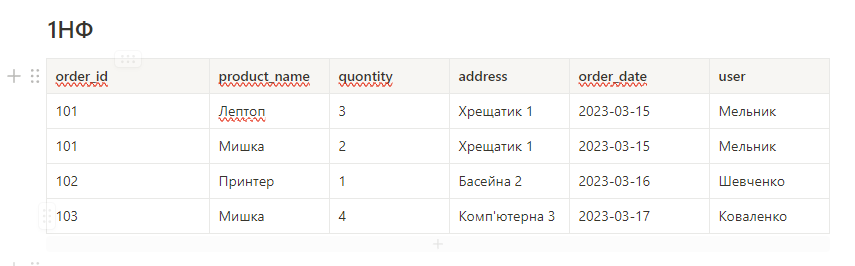
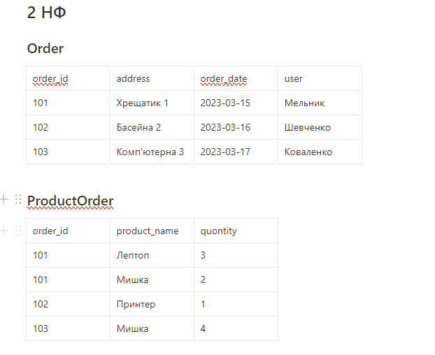
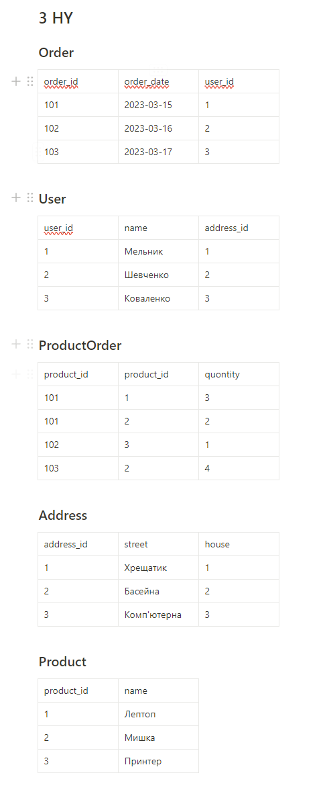

## Homework 1: Relational Databases: Concepts and Techniques

***

### 1NF:

### 2NF:

### 3NF:

### Schemas:

### Address Table:

### Order Table:

### Order Product Table:

### Product Table:

### User Table:

